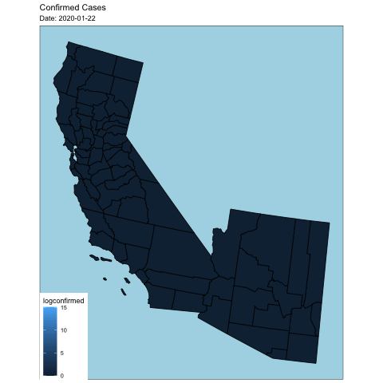

```{r setup, include=FALSE}
knitr::opts_chunk$set(echo = TRUE)
```

This notebook contains some data exploration for COVID-19 using the data published in Feb 2020, which may help you get started. You do _not_ have to use it. Note below code may change frequently.

## Import JHU SSE data on GitHub into R

Since Feb 11, JHU SSE is hosting 2019 nCoV data on GitHub repo: <https://github.com/CSSEGISandData/2019-nCoV>. Let's import the time series data directly from the csv file on GitHub.
```{r}
library(tidyverse)
library(lubridate)
confirmed=read_csv(file="time_series_covid19_confirmed_US.csv", show_col_types = FALSE)
deaths=read_csv("time_series_covid19_deaths_US.csv", show_col_types = FALSE)
```

## Tidy data

Tidy data into the long format. `pivot_longer` is the modern version of `gather` function in dplyr.
```{r}
confirmed_long <- confirmed %>%
  select(-c(UID:code3, Country_Region, Combined_Key)) %>%
  pivot_longer(-(FIPS:`Long_`), 
               names_to = "Date", 
               values_to = "confirmed") %>%
  mutate(Date = (mdy(Date))) # convert string to date-time
confirmed_long
```

```{r}
death_long <- deaths %>% 
  select(-c(UID:code3, Country_Region, Combined_Key)) %>%
  pivot_longer(-c(FIPS:`Long_`, Population), 
               names_to = "Date", 
               values_to = "death") %>%
  mutate(Date = mdy(Date))
death_long
```

```{r}
ncov_tbl <- confirmed_long %>%
  left_join(death_long) %>%
  rename(fips=FIPS)
  #pivot_longer(c(confirmed,death), 
  #             names_to = "Case", 
  #             values_to = "Count")
ncov_tbl %>% print(width = Inf)
```


## Mapping US counties

Some useful resources for mapping:  
- The book [_Geocomputation with R_](https://geocompr.robinlovelace.net). Especially [Chapter 8 Making Maps with R](https://geocompr.robinlovelace.net/adv-map.html).  
- The book [_An Introduction to Spatial Analysis and Mapping in R_](https://bookdown.org/lexcomber/brunsdoncomber2e/). 

### The county map
```{r}
library(usmap)
library(ggplot2)

plot_usmap(regions = "counties") + 
  labs(title = "US Counties",
       subtitle = "This is a blank map of the counties of the United States.") + 
  theme(panel.background = element_rect(color = "black", fill = "lightblue"))
```

### Add values to map

```{r}
most_recent <- ncov_tbl %>%
  filter(Date=="2022-10-04")

plot_usmap(data=most_recent, values="confirmed", include = c("CA", "AZ")) + 
  labs(title = "US Counties",
       subtitle = "Confirmed COVID cases of the counties of CA and AZ on 2022-10-04") + 
  theme(panel.background = element_rect(color = "black", fill = "lightblue"))
```


## Animation

Resources about making animations in R:  
- [gganimate](https://gganimate.com/index.html) package.  
- Section 8.3 of [Geomcomputation with R](https://geocompr.robinlovelace.net/adv-map.html#animated-maps). 

Plot the date at all time points (this takes long, a couple minutes):
```{r}
library(gganimate)
ncov_tbl <- ncov_tbl %>%
  mutate(logconfirmed=if_else(confirmed==0, 0, log(confirmed)))
basemap <- plot_usmap(data=ncov_tbl, values="logconfirmed", include = c("CA", "AZ")) +
  theme(panel.background = element_rect(color = "black", fill = "lightblue"))
basemap
```

Then to that plot I am going to use `labs()` to add a title that will count up each date and add `transition_time(Date)`, which will make a separate plot for each day that can be animated together.

```{r eval=FALSE}
library(gifski)
num_date <- max(ncov_tbl$Date) - min(ncov_tbl$Date) + 1
anim <- basemap + 
  transition_time(Date) + 
  labs(title = "Confirmed Cases", subtitle = "Date: {frame_time}")
animate(anim, renderer = gifski_renderer())
anim_save("confirmed_anim.gif")
```

<p align="left">
  
</p>
